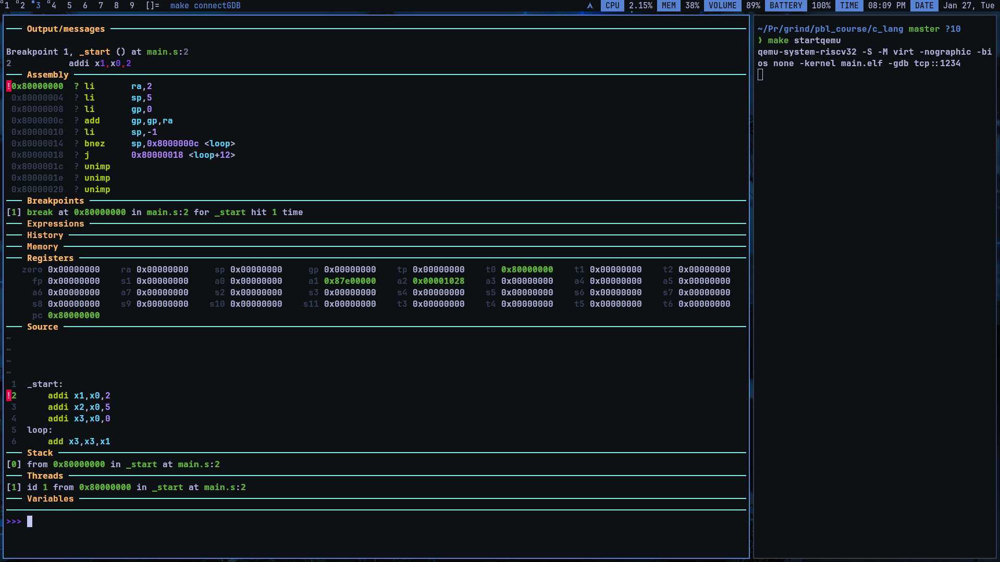

# Intro To Assembly

Below is the main.s

```cpp
_start:
    addi x1,x0,2
    addi x2,x0,5
    addi x3,x0,0
loop:
    add x3,x3,x1
    addi x2,x0,-1
    bne x2,x0,loop
j .

```
and this is main.ld , both `main.s` and `main.ld` are compiled together

```c
 MEMORY
{
    RAM (rwx) : ORIGIN = 0x80000000, LENGTH = 4K
}

SECTIONS
{
    .text : {
        *(.text*)
    } > RAM
} 

```



so as we can see from both the gdb screenshot and linkerscript the starting address of code is starting from **0x80000000**

