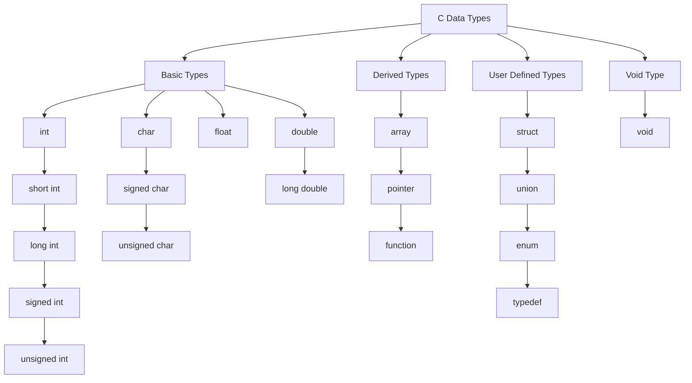

# Data Types

```mermaid
flowchart TB

A[C Data Types]

A --> B[Basic Types]
A --> C[Derived Types]
A --> D[User Defined Types]
A --> E[Void Type]

%% BASIC TYPES (vertical)
B --> B1[int]
B1 --> B11[short int]
B11 --> B12[long int]
B12 --> B13[signed int]
B13 --> B14[unsigned int]

B --> B2[char]
B2 --> B21[signed char]
B21 --> B22[unsigned char]

B --> B3[float]

B --> B4[double]
B4 --> B41[long double]

%% DERIVED TYPES (vertical)
C --> C1[array]
C1 --> C2[pointer]
C2 --> C3[function]

%% USER DEFINED (vertical)
D --> D1[struct]
D1 --> D2[union]
D2 --> D3[enum]
D3 --> D4[typedef]

%% VOID
E --> E1[void]

```