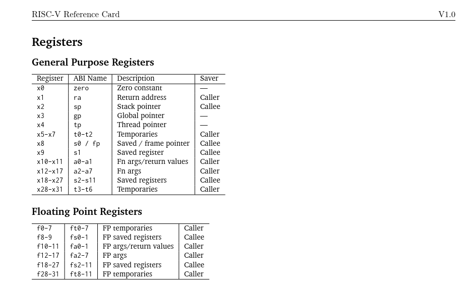
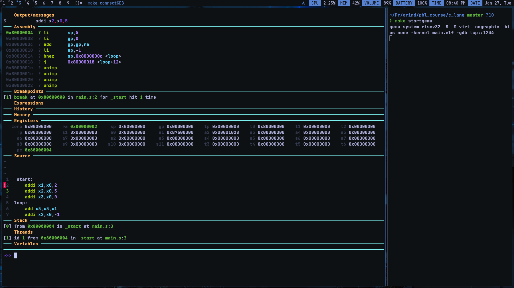
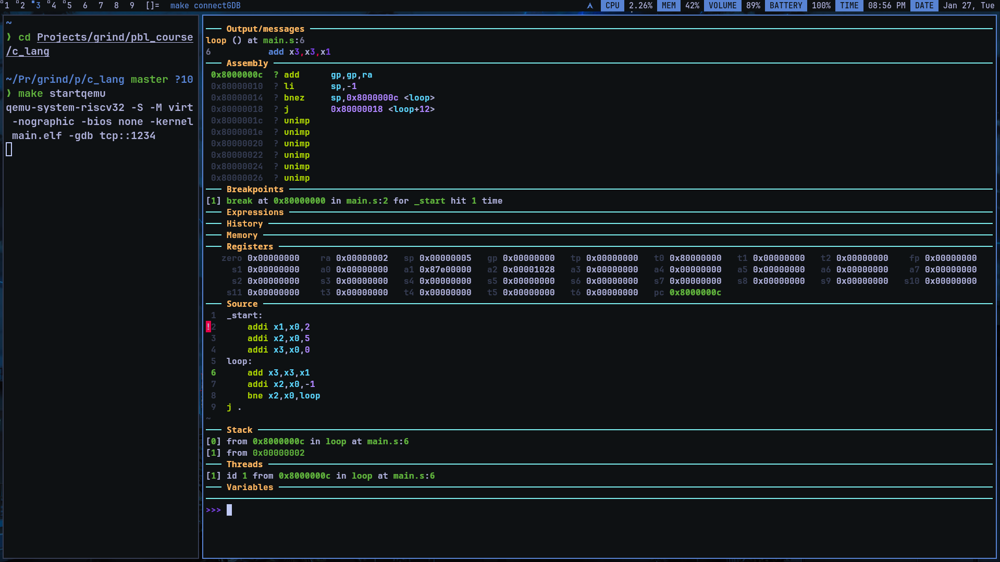
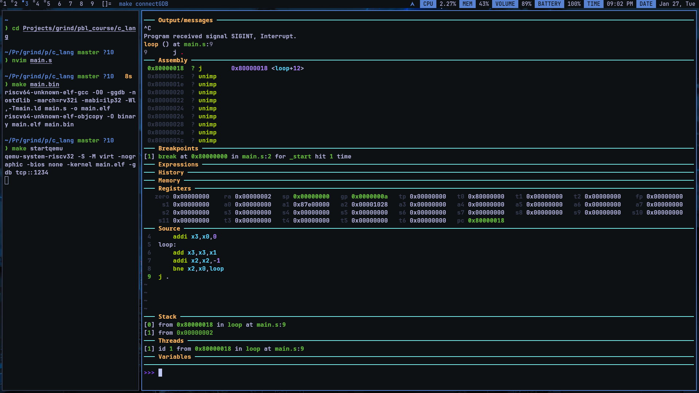

# Intro To Assembly

Below is the main.s

```cpp
_start:
    addi x1,x0,2
    addi x2,x0,5
    addi x3,x0,0
loop:
    add x3,x3,x1
    addi x2,x0,-1
    bne x2,x0,loop
j .

```
and this is main.ld , both `main.s` and `main.ld` are compiled together

```c
 MEMORY
{
    RAM (rwx) : ORIGIN = 0x80000000, LENGTH = 4K
}

SECTIONS
{
    .text : {
        *(.text*)
    } > RAM
} 

```


- so as we can see from both the gdb screenshot and linkerscript the starting address of code is starting from **0x80000000**.
- also, there is an exclaimation mark left of the line below *_start* that means after starting the gdb it stoped at the mark.
- in the **Assembly** section we can see that their is no `x1` , `x2` or any reg int the code above or as well in the **Source** section because of this



from the card we can see that register name are aliased to somethign called *ABI name*.



now, when i entered `ni` in the command line it executes the next line from the screenshot we can see the cvalue of registers:
- pc changed from **0x80000000** to **0x80000004** (increment of 4 byte(32 bit instruction)) and the `ra` value updated to 2




what i did is i typed ni till the program enters in the loop so all the values of the registes are updated as it should be - 2, 5, 0

> Error: I wrote a wrong code in the line where i am decrimenting the x2 register for the loop i did `addi x2,x0,-1` which is wrong, it sets x2 to -1 or in this case overflow occors and its sets to *0xffffffff* so i changed it to correct code `addi x2,x2,-1`.


after this i entered `c` to continue the program uninterepted


from this we can see that the register x3 or gp is set to `0x0000000a` which is 10 in decimal (thats what we wanted) and the *pc* is set to `0x80000018` which is the last line of that code.