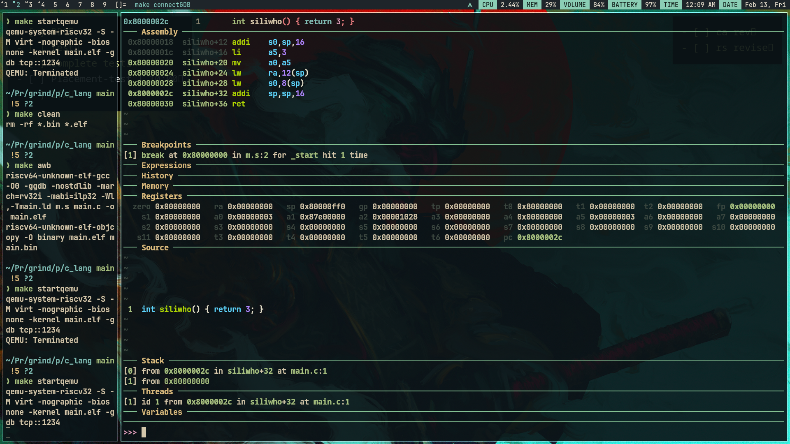
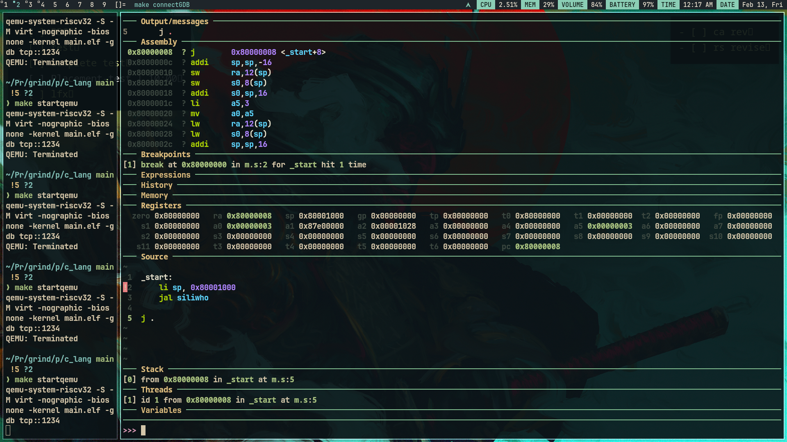
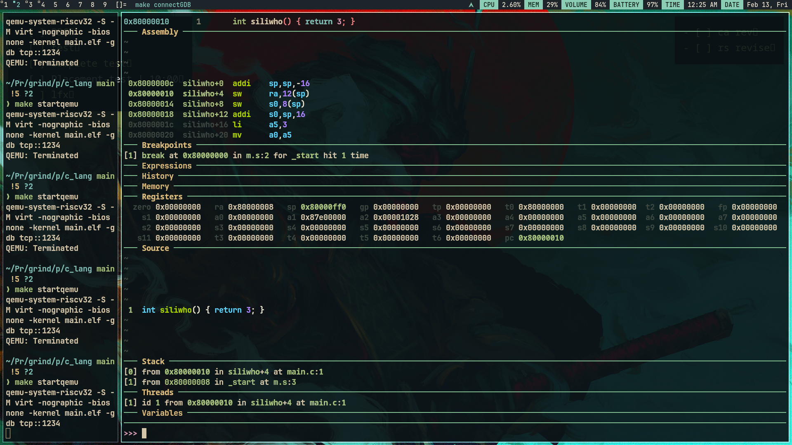

# Intro to Assembly

I am converting the main.c to assembly:

```c
int siliwho() { return 3; }
```

below is the makefile

```makefile
assembly: main.c
	riscv64-unknown-elf-gcc -O0 -ggdb -nostdlib -march=rv32i -mabi=ilp32 -Wl,-Tmain.ld main.c -S

binary: main.s main.ld
	riscv64-unknown-elf-gcc -O0 -ggdb -nostdlib -march=rv32i -mabi=ilp32 -Wl,-Tmain.ld main.s -o main.elf
	riscv64-unknown-elf-objcopy -O binary main.elf main.bin

printbin: main.bin
	xxd -e -c 4 -g 4 main.bin

startqemu: main.elf
	qemu-system-riscv32 -S -M virt -nographic -bios none -kernel main.elf -gdb tcp::1234

connectGDB: main.elf
	riscv64-elf-gdb main.elf -ex "target remote localhost:1234" -ex "break _start" -ex "continue" - q

clean:
	rm -rf *.bin *.elf

```

so in the **assembly** section of the above makefile we added, we say the gcc generate the assembly code from main.c and put it in _main.s_, do nothing more nothing less.


the line `riscv64-unknown-elf-gcc -O0 -ggdb -nostdlib -march=rv32i -mabi=ilp32 -Wl,-Tmain.ld main.c -S` resulted in this large assembly but most of the content in the assembly file are atttributes(this is because of -ggdb flag(this integrates binary so that we can work with gdb)).

> attribute:

so i removed this flag and the resulting assembly is smaller then previous one.

```c
	.file	"main.c"
	.option nopic
	.attribute arch, "rv32i2p1"
	.attribute unaligned_access, 0
	.attribute stack_align, 16
	.text
	.align	2
	.globl	siliwho
	.type	siliwho, @function
siliwho:
	addi	sp,sp,-16
	sw	ra,12(sp)
	sw	s0,8(sp)
	addi	s0,sp,16
	li	a5,3
	mv	a0,a5
	lw	ra,12(sp)
	lw	s0,8(sp)
	addi	sp,sp,16
	jr	ra
	.size	siliwho, .-siliwho
	.ident	"GCC: (g1b306039a) 15.1.0"
	.section	.note.GNU-stack,"",@progbits
```

this removes major attributes of the program.

Now, we know that if i want to execute a simple c code, it wouldnt run if there is no `int main()` in it because OS searches for `_start` in the assembly of the c file, but in the above code i wrote `int siliwho()` instead.
to solve that i will make a **m.s** that will tell gcc to jump to a lable, that is `siliwho`

So, in previous notes [Intro to GDB](./gdb-intro.md) I made on assembly file:

```cpp
_start:
    addi x1,x0,2
    addi x2,x0,5
    addi x3,x0,0
loop:
    add x3,x3,x1
    addi x2,x0,-1
    bne x2,x0,loop
j .

```

so in this i am replace all the content to `j siliwho` that will tell it to jump to it:

```c
_start:
    j siliwho

j .
```

and this is the compilation command that will tell gcc to compile and links m.s (assembly) + main.c (C)

```makefile
awb: main.c m.s
	riscv64-unknown-elf-gcc -O0 -ggdb -nostdlib -march=rv32i -mabi=ilp32 -Wl -Tmain.ld m.s main.c -o main.elf
	riscv64-unknown-elf-objcopy -O binary main.elf main.bin
```


after entering `ni` one time we can see the code jumped to the `int siliwho()`


now, look at the register window carefully:

```c
sp 0x00000000
```

Now the first instruction in siliwho:
```c
addi sp, sp, -16
```

That becomes: `sp = 0xFFFFFFF0`


in the next instruction `sw ra, 12(sp)`
if we compute that address.
```c
sp = 0xFFFFFFF0
12(sp) = 0xFFFFFFF0 + 12
       = 0xFFFFFFFC
```

so, the program is writing to `0xFFFFFFFC` which is invalid because this is outside the RAM region.
We can also see this in the linker script:
``` c
RAM ORIGIN = 0x80000000, LENGTH = 4K
```
which means valid RAM size is from **0x80000000** to **0x80001000**


thats why this results to cant access the address `0x0`.

To correct this we can initialize the stack pointer with some value like `0x80001000`

after updating the `m.s` and executing it till the last instruction.


from this we can see there is nothing in front of return
```c
0x80000030  siliwho+36 ret
```
so when i go to next inst. it fails because in assembly program i wrote it to directly jump to `siliwho` so it doesnt have return address, to correct it i will change the *m.s* to 
```js
_start:
    li sp, 0x80001000
    jal siliwho

j .
```


When I started GDB and executed `ni` (next instruction), it executed the entire function `siliwho` and returned to `_start`.

We can see that register **a5** is updated to **3**, which matches the return value of the function:



This happens because `ni` treats a function call (`jal`) as a single instruction and executes the whole function before moving to the next instruction (in this case, `j .`).

If we want to step into `siliwho` and execute each instruction one by one, we should use:

```
si
```

`si` means **step into**, which allows us to enter the function and execute its instructions individually:



we can see i am in the `siliwho()` function now this program is correct as it exits after last instruction.

